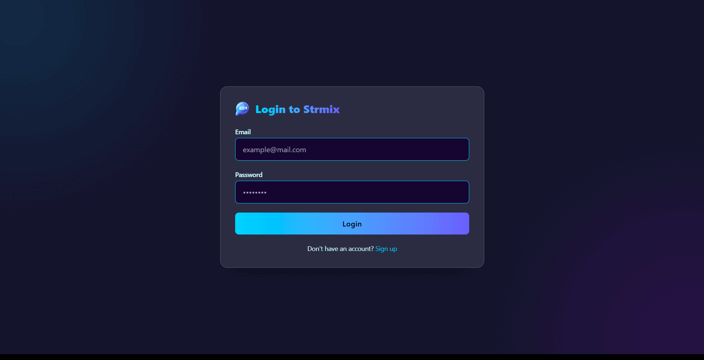

# 🌐 Strmix.live – Real-time Language Exchange Platform

## 📽️ Preview


---

## 🚀 Features

- 🎥 Real-time video conferencing using **WebRTC**
- 💬 Seamless live chat with **Stream Chat API** integration
- 🖥️ Screen sharing for collaborative learning
- 👥 Dynamic multi-user room management
- ⚡ Responsive UI with **TanStack Query** for real-time data caching
- 🔔 Presence detection and message delivery tracking

---

## 🛠️ Tech Stack

- **Frontend:** React.js, Tailwind CSS
- **Backend:** Node.js, Express.js
- **Chat:** Stream Chat (getstream.io)
- **State Management:** TanStack Query
- **Database:** MongoDB Atlas
- **Deployment:** Render

---

## 📦 Getting Started

```bash
# Clone the repository
git clone https://github.com/aashish-mitt96/strmix.live.git
cd strmix.live

# Install server dependencies
cd server
npm install

# Install client dependencies
cd ../client
npm install

# Set up environment variables
# Create `.env` files in both server and client with your API keys

# Run both client and server (you can use concurrently or run in separate terminals)
npm run dev  # for Vite client
npm run server  # for backend
